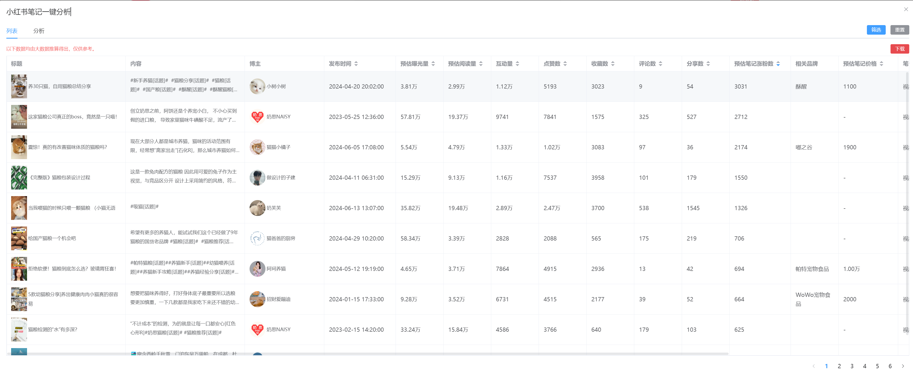
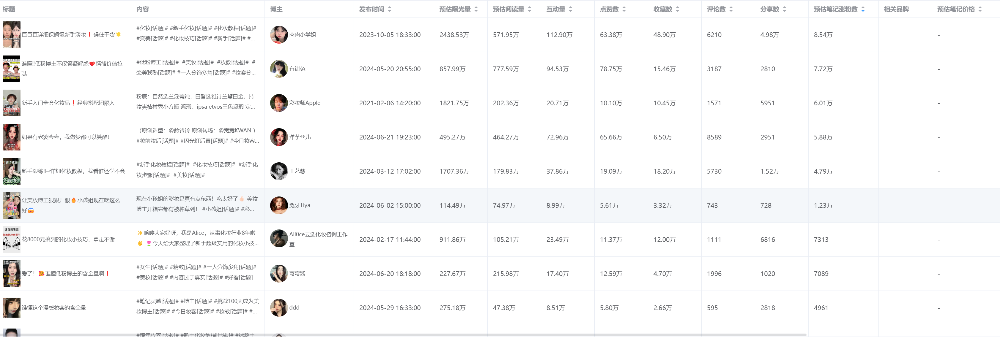
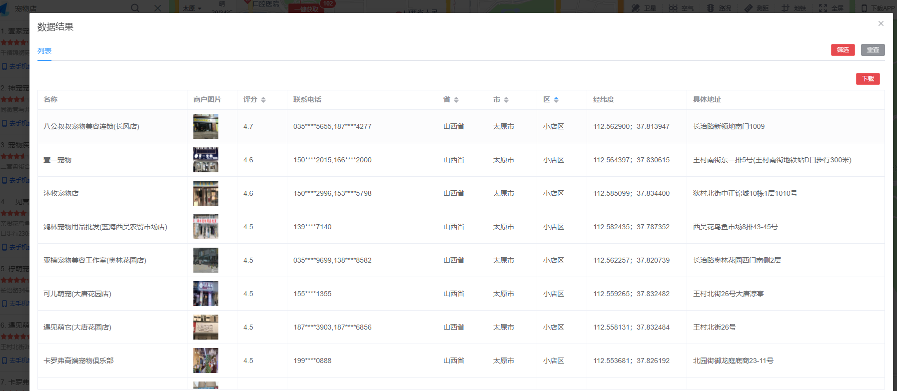
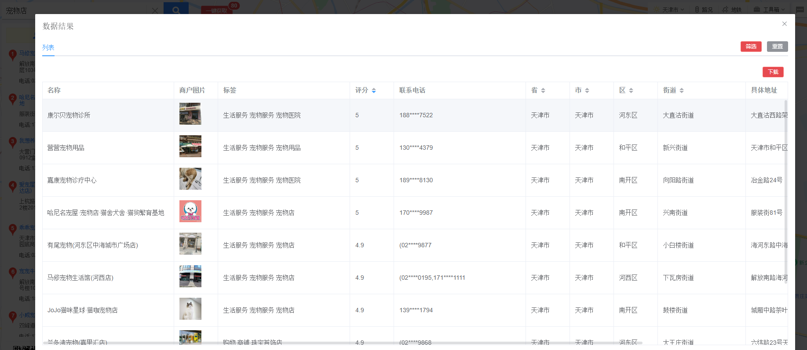
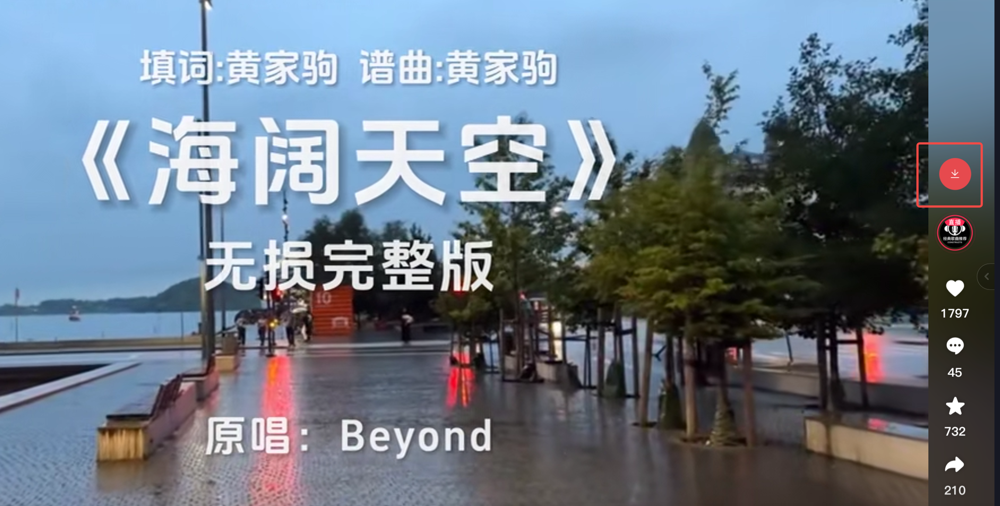
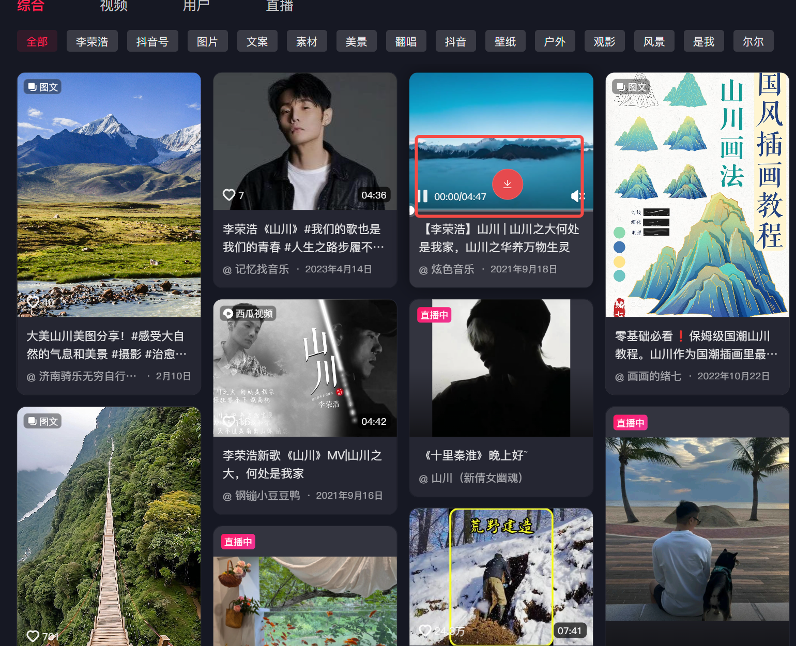

<h1>XHS-DY-Tools</h1>

🔥 <b>小红书/抖音作品无水印采集工具、地图商家下载工具</b>：小红书搜索结果批量下载：批量下载小红书博主的所有笔记；支持笔记评论(包括子评论)下载；下载小红书无水印作品文件；下载抖音无水印视频文件；批量下载地图商家信息！

本程序是浏览器插件，支持Chrome、Edge浏览器安装

<h1>📑 项目功能</h1>
<ul><b>程序功能</b>
<li>✅ 采集下载小红书作品信息</li>
<li>✅ 小红书博主笔记批量下载</li>
<li>✅ 下载小红书无水印作品文件</li>
<li>✅ 下载小红书笔记评论(包括子评论)</li>
<li>✅ 下载抖音无水印视频</li>
<li>✅ 下载地图商家信息(支持百度地图、高德地图)</li>
</ul>
<h1>📸 程序截图</h1>

<h1>🗳 安装说明</h1>
<a href="https://glbjknw7a4.feishu.cn/docx/CeMZdqITQo5cuSxG9RocpQ4Wn9e" target="_blank">点击链接前往飞书说明文档</a>
<h1>⚠️ 免责声明</h1>
<ul>
<li>使用者对本项目的使用由使用者自行决定，并自行承担风险。作者对使用者使用本项目所产生的任何损失、责任、或风险概不负责。</li>
<li>使用者在使用本项目的功能时，必须自行研究相关法律法规，并确保其使用行为合法合规。任何因违反法律法规而导致的法律责任和风险，均由使用者自行承担。</li>
</ul>
<b>在使用本项目的功能之前，请您认真考虑并接受以上免责声明。如果您对上述声明有任何疑问或不同意，请不要使用本项目的功能。如果您使用了本项目的功能，则视为您已完全理解并接受上述免责声明，并自愿承担使用本项目的一切风险和后果。</b>